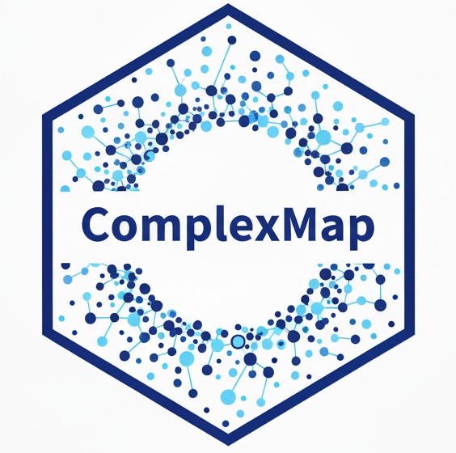

# ComplexMap 

[](https://lifecycle.r-lib.org/articles/stages.html)
[](https://opensource.org/licenses/MIT)

**ComplexMap** is an R package that provides a complete, end-to-end workflow for the analysis of protein complex datasets. It is designed to take a raw list of putative protein complexes and transform it into a fully annotated, publication-ready functional map.

## Core Features

-   **Integrated Workflow:** Go from a raw complex list to a final network map with a single function, `createComplexMap()`.

-   **Quality Control & Refinement:** Automatically filter complexes by size and merge redundant groups to create a clean, non-redundant dataset.

-   **Functional Enrichment:** Annotate complexes using gene sets from local files, MSigDB, Gene Ontology, or Reactome.

-   **Powerful Visualizations:** Generate static (ggplot2) and interactive (visNetwork) plots to explore the functional landscape.

-   **Quantitative Analysis:** Summarize biological themes using community detection and programmatically query the map for specific proteins, complexes, or themes.

-   **Benchmarking:** Quantitatively evaluate your predicted complexes against a reference standard like CORUM.

---

## Installation

You can install the stable version of **ComplexMap** from GitHub. The installer will automatically handle all required dependencies from CRAN and Bioconductor.

```r
# If you don't have remotes installed: install.packages("remotes")
remotes::install_github("zqzneptune/ComplexMap")
```

---

## Workflow at a Glance

This example demonstrates the core workflow: analyzing the included human protein complex dataset and generating a functional map with a single command.

```r
library(ComplexMap)

# 1. Load the example complex list and a gene set file
utils::data("demoComplexes")
gmt_file <- ComplexMap::getExampleGmt()
gmt <- ComplexMap::getGmtFromFile(gmt_file, verbose = FALSE)

# 2. Run the entire workflow
# We can pass arguments to underlying functions, like `mergeThreshold`, directly.
cm_obj <- ComplexMap::createComplexMap(
  complexList = demoComplexes,
  gmt = gmt,
  mergeThreshold = 0.8,
  verbose = FALSE # Set to TRUE to see workflow steps
)

# 3. Print the resulting object for a high-level summary
cm_obj
#> # A ComplexMap Object
#> ── 490 nodes and 12931 edges
#> ── 15 major biological themes identified.
#> ── Use `getNodeTable()` or `getEdgeTable()` to access data.

# 4. Visualize the map
node_tbl <- ComplexMap::getNodeTable(cm_obj)
edge_tbl <- ComplexMap::getEdgeTable(cm_obj)

ComplexMap::visualizeMapWithLegend(node_tbl, edge_tbl, verbose = FALSE)
```


---

## Exploring the Results

The `ComplexMap` object can be easily analyzed with downstream functions.

### Summarize Biological Themes

Identify the major biological themes (network modules) using community detection.

```r
theme_summary <- ComplexMap::summarizeThemes(cm_obj, verbose = FALSE)

# Show the 10 largest themes
dplyr::slice_max(theme_summary, n = 10, order_by = nodeCount)
```

### Query the Map

Programmatically find specific complexes of interest.

```r
# Find the complex with the ID "CpxMap_0001"
result <- ComplexMap::queryMap(cm_obj, query = "CpxMap_0001", type = "complex")

# Show some of its key attributes
dplyr::select(result, complexId, primaryFunctionalDomain, proteinCount, degree)
```

## Citation

If you use ComplexMap in your research, please cite the publication (link to be added upon publication).

For now, you can cite the package itself:

```Qingzhou Zhang (2025). ComplexMap: A Toolset for the Functional Analysis and
Visualization of Protein Complex Data. R package version 1.0.0.
https://github.com/zqzneptune/ComplexMap
```

## Contributing

Please note that the ComplexMap project is released with a [Contributor Code of Conduct](https://contributor-covenant.org/version/2/1/code_of_conduct/code_of_conduct.md). By contributing to this project, you agree to abide by its terms. We welcome bug reports, feature requests, and pull requests.
