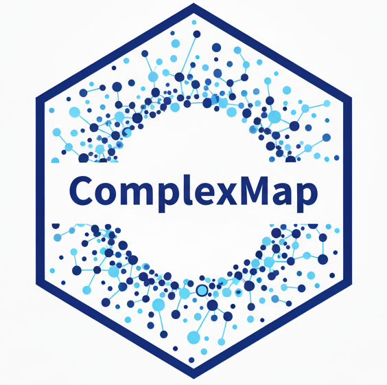

# ComplexMap 

[](https://lifecycle.r-lib.org/articles/stages.html)
[](https://opensource.org/licenses/MIT)

**ComplexMap** is a systems biology R package for the analysis of protein complex landscapes. It transforms raw lists of putative complexes into interactive, functionally annotated maps that preserve the delicate balance between physical composition and biological hierarchy.

That makes perfect sense and aligns exactly with your `createComplexMap(..., ifRefineCpx = FALSE)` default and your custom hypergeometric test logic in `runComplexEnrichment`. 

Here is the updated and polished feature list incorporating those crucial details:

## Core Features (v2.0)

 **Species-Agnostic, Specificity-Driven Annotation:** Enrichment works with any organism or identifier type (e.g., Symbol, Uniprot, Entrez)—as long as the IDs in your complexes match your gene sets. Automatically clusters functional terms into semantic domains and calculates **Specificity Scores** (`-log10(p.adjust) * log2(Fold)`) to prioritize highly specific biological labels over broad terms.

**Optional Diversity-First Refinement:** Turned off by default in the main pipeline to strictly preserve your raw input. When enabled, it uses a conservative **Jaccard** similarity (threshold 0.90) to merge only true synonyms, safely preserving distinct biological sub-complexes and variants.

**Physical-First Architecture:** Layouts are driven primarily by **Physical Composition** (75% shared proteins), ensuring that physical variants are positioned by true structural overlap rather than being visually pulled together by generic functional annotations.

**Interactive Explorer:** Built-in **Cytoscape.js** engine via Shiny. Explore your complex-complex landscape with high-performance zooming, filtering, and real-time node inspection.

**Systems Biology Dashboard:** S3 print methods provide immediate console feedback on the health of your map (Functional Diversity vs. Physical Density).

**Robust Evaluation:** Compare predictions against gold standards (e.g., CORUM) using **Maximum Matching Ratio (MMR)**, Accuracy, PPV, and Sensitivity.

---

## Installation

You can install the stable version of **ComplexMap** from GitHub. 

```r
# install.packages("remotes")
remotes::install_github("zqzneptune/ComplexMap")
```

---

## Workflow at a Glance

This example demonstrates the complete workflow from raw complexes to an interactive map.

```r
library(ComplexMap)

# 1. Load demo complexes and example GMT
data("demoComplexes", package = "ComplexMap")
gmt_file <- getExampleGmt()
gmt <- getGmtFromFile(gmt_file, verbose = FALSE)

# 2. Build the ComplexMap
# alpha = 0.75 prioritizes physical structure in the layout
cmap <- createComplexMap(
  complexList = demoComplexes[1:250], 
  gmt = gmt,
  ifRefineCpx = TRUE,
  alpha = 0.75,
  verbose = TRUE
)

# 3. Inspect the Dashboard
cmap
#> # ComplexMap Object (Physical-First Layout)
#> # -- Physical Structure: 224 nodes, 412 edges (1.84 edges/node)
#> # -- Functional Landscape:
#> #    * Diversity: 25 distinct functional domains (colors)
#> #    * Coverage:  42.5% of complexes annotated
#> # -- Accessors: `getNodeTable()`, `getEdgeTable()`
#> # -- Explore:   `explore(cmap)` to launch interactive viewer.

# 4. Explore Interactively
explore(cmap)
```

---

## Targeted Exploration

### Powerful Querying
The `queryMap` function supports exact matches for Complex IDs or regex searches for protein members.

```r
# Find all complexes containing the protein SMAD4
res <- queryMap(cmap, query = "SMAD4", type = "protein")

# View the dominant functions and membership
dplyr::select(res, complexId, primaryFunctionalDomain, proteinCount)
```

### External Export
Export your landscape to standard formats for high-resolution publication figures in **Cytoscape Desktop** or **Gephi**.

```r
# Exports node and edge TSVs sanitized for Cytoscape Desktop
exportNetwork(cmap, filePrefix = "human_proteome_map", format = "cytoscape")

# Export as GraphML
exportNetwork(cmap, filePrefix = "human_proteome_map", format = "graphml")
```

## Performance Benchmarking

Optimize your refinement strategy by testing multiple thresholds against a reference set (e.g., CORUM).

```r
data("referenceComplexes", package = "ComplexMap")

bench <- benchmarkParameters(
  complexList = demoComplexes[1:100],
  referenceComplexes = referenceComplexes,
  threshold_range = seq(0.7, 1.0, by = 0.05)
)
```

## Citation

If you use ComplexMap in your research, please cite:

Qingzhou Zhang (2026). **ComplexMap: A Toolset for the Functional Analysis and Interactive Visualization of Protein Complex Landscapes.** R package version 2.0.0. 
https://github.com/zqzneptune/ComplexMap

## Contributing

The ComplexMap project is released with a [Contributor Code of Conduct](https://contributor-covenant.org/version/2/1/code_of_conduct/code_of_conduct.md). We welcome bug reports, feature requests, and pull requests via GitHub issues.
