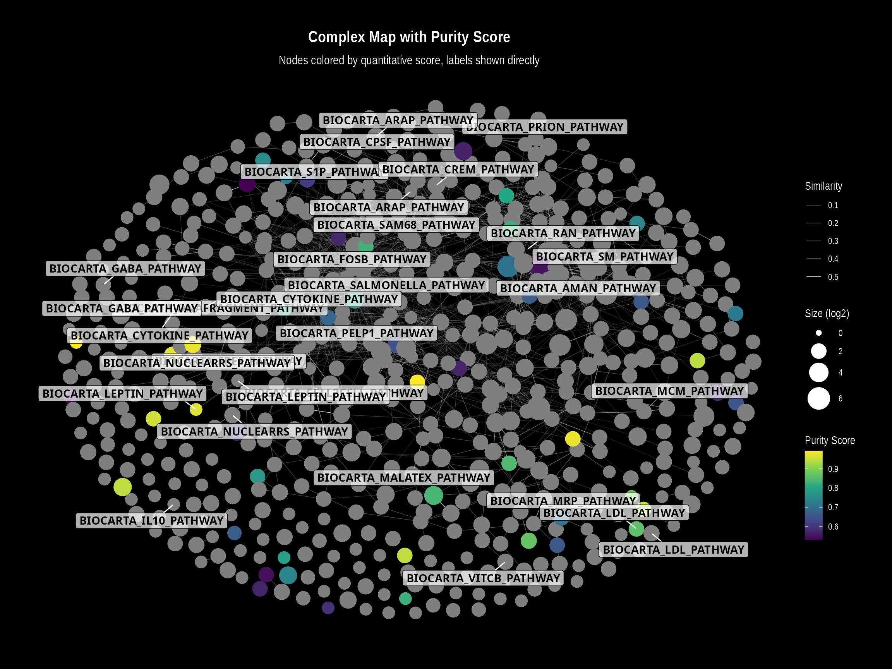
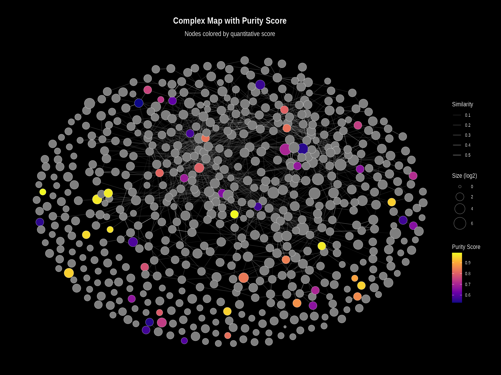

# 4. Visualizing Quantitative Data

## Integrating Experimental Data into the Network

While the default `ComplexMap` visualizations color complexes by their
primary functional domain, a powerful advanced use-case is to map
quantitative experimental data directly onto the network nodes. This
allows you to visualize other biological information—such as complex
abundance, purity scores, or differential expression—in the context of
the functional map.

All three core visualization functions (`visualizeMapDirectLabels`,
`visualizeMapWithLegend`, and `visualizeMapInteractive`) support this
feature through a consistent interface. This vignette provides a
step-by-step workflow for creating continuous color visualizations from
your own **complex-level** quantitative data.

This workflow requires the following packages:

``` r
library(ComplexMap)
library(dplyr)
```

### Step 1: Generate a Stable Base Map

The first step is to generate a complete `ComplexMap` object. This
provides the stable network topology and layout that will serve as the
canvas for our quantitative data.

``` r
# Load the package's demo complexes and example GMT file
data(demoComplexes)
gmtPath <- getExampleGmt()
gmt <- getGmtFromFile(gmtPath, verbose = FALSE)

# Run the full workflow to get a ComplexMap object
cm_obj <- createComplexMap(
  complexList = demoComplexes,
  gmt = gmt,
  mergeThreshold = 0.8,
  verbose = FALSE
)

# Extract the node and edge tables
node_table <- getNodeTable(cm_obj)
edge_table <- getEdgeTable(cm_obj)

cat("Generated a base map with", nrow(node_table), "nodes.\n")
#> Generated a base map with 510 nodes.
```

### Step 2: Prepare Your Quantitative Data

This workflow assumes you have a data frame with **complex-level**
quantitative data. The data frame must contain a column with the complex
IDs that match the `complexId` in the `ComplexMap` node table (e.g.,
“CpxMap_0001”), and at least one other numeric column with the values
you wish to visualize.

Let’s create some sample data representing a “purity score” for a subset
of our complexes.

``` r
# Create sample complex-level data
set.seed(123) # for reproducibility
complex_quant_data <- tibble(
  complexId = sample(node_table$complexId, size = 50),
  purity_score = runif(50, min = 0.5, max = 1.0)
)

head(complex_quant_data)
#> # A tibble: 6 × 2
#>   complexId   purity_score
#>   <chr>              <dbl>
#> 1 CpxMap_0290        0.561
#> 2 CpxMap_0029        0.780
#> 3 CpxMap_0272        0.603
#> 4 CpxMap_0148        0.564
#> 5 CpxMap_0460        0.877
#> 6 CpxMap_0336        0.948
```

### Step 3: Join Quantitative Data to the Node Table

Next, we simply join our new complex-level quantitative data back to the
main node table. We use a `left_join` to ensure all original nodes are
kept, even those without quantitative data.

``` r
# Join the quantitative data to the main node table
nodes_with_quant <- node_table %>%
  left_join(complex_quant_data, by = "complexId")

# Preview the new column. Note that complexes without data have NA.
head(select(nodes_with_quant, complexId, primaryFunctionalDomain, purity_score))
#> # A tibble: 6 × 3
#>   complexId   primaryFunctionalDomain     purity_score
#>   <chr>       <chr>                              <dbl>
#> 1 CpxMap_0359 BIOCARTA_CACAM_PATHWAY                NA
#> 2 CpxMap_0414 BIOCARTA_PROTEASOME_PATHWAY           NA
#> 3 CpxMap_0508 Unenriched                            NA
#> 4 CpxMap_0401 BIOCARTA_CACAM_PATHWAY                NA
#> 5 CpxMap_0509 BIOCARTA_PROTEASOME_PATHWAY           NA
#> 6 CpxMap_0090 BIOCARTA_PTDINS_PATHWAY               NA
```

### Step 4: Visualize the Map Using Any Function

Now that our data is prepared, we can use any of the core visualization
functions. The key is to use the `color.by` argument to specify which
numeric column should be used for the color gradient.

#### Plot 1: Direct Labels Visualization

This plot is ideal for detailed inspection where labels do not overlap
significantly. The function will automatically generate a continuous
color bar legend for our `purity_score`.

``` r
visualizeMapDirectLabels(
  layoutDf = nodes_with_quant,
  edgesDf = edge_table,
  title = "Complex Map with Purity Score",
  subtitle = "Nodes colored by quantitative score, labels shown directly",
  
  # --- Key arguments for continuous coloring ---
  color.by = "purity_score",
  color.palette = "viridis", 
  color.legend.title = "Purity Score"
)
```



#### Plot 2: Visualization with Legend

This plot uses the same underlying logic but is designed for overviews.
When `color.by` is specified, it overrides the default discrete legend
(for functional domains) and instead creates a continuous color bar,
just like the direct labels plot.

``` r
visualizeMapWithLegend(
  layoutDf = nodes_with_quant,
  edgesDf = edge_table,
  title = "Complex Map with Purity Score",
  subtitle = "Nodes colored by quantitative score",
  
  # --- Key arguments for continuous coloring ---
  color.by = "purity_score",
  color.palette = "plasma", # We can easily switch palettes
  color.legend.title = "Purity Score"
)
```



#### Plot 3: Interactive Visualization

The same principle applies to the interactive plot. By specifying
`color.by`, the function will color the nodes on a gradient and,
importantly, will **add the quantitative value to the hover tooltip**
for easy data exploration.

``` r
visualizeMapInteractive(
  layoutDf = nodes_with_quant,
  edgesDf = edge_table,
  title = "Interactive Complex Map with Purity Score",
  
  # --- Key arguments for continuous coloring ---
  color.by = "purity_score",
  color.palette = "viridis"
)
```

This consistent interface across all three visualization functions
provides maximum flexibility for exploring and presenting your
quantitative data in the context of the protein complex network.
