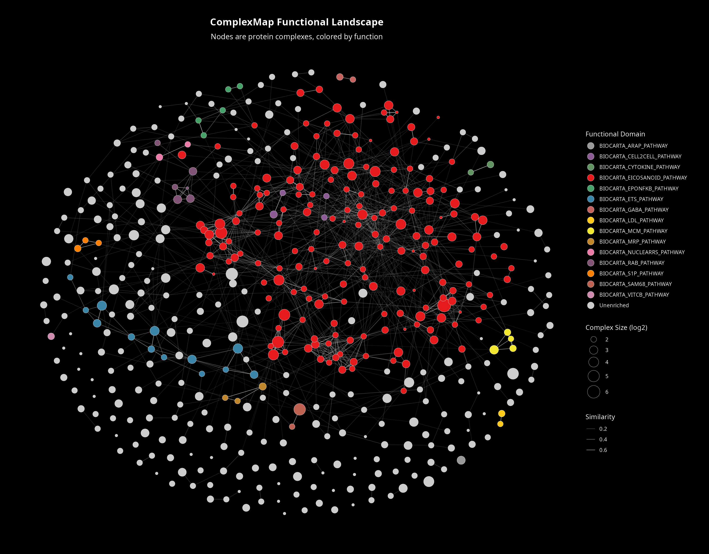

# ComplexMap 

[](https://lifecycle.r-lib.org/articles/stages.html)
[](https://opensource.org/licenses/MIT)

**ComplexMap** is an R package that provides a complete, end-to-end
workflow for the analysis of protein complex datasets. It is designed to
take a raw list of putative protein complexes and transform it into a
fully annotated, publication-ready functional map.

## Core Features

- **Integrated Workflow:** Go from a raw complex list to a final network
  map with a single function,
  [`createComplexMap()`](https://zqzneptune.github.io/ComplexMap/reference/createComplexMap.md).

- **Diversity-Focused Refinement:** Defaults to a conservative
  **Jaccard** similarity metric to merge only highly redundant
  complexes, preserving biologically meaningful variants like
  sub-complexes. Other metrics (**Matching Score**, **Simpson**, or
  **Dice**) are available for more aggressive merging.

- **Functional Enrichment:** Annotate complexes using gene sets from
  local files, MSigDB, Gene Ontology, or Reactome.

- **Powerful Visualizations:** Generate static (`ggplot2`) and
  interactive (`visNetwork`) plots to explore the functional landscape.

- **Quantitative Data Integration:** Map your own experimental data
  (e.g., protein abundance, fold-change) directly onto network nodes as
  a continuous color gradient in any of the visualization functions.

- **Robust Benchmarking:** Optimize refinement parameters with
  [`benchmarkParameters()`](https://zqzneptune.github.io/ComplexMap/reference/benchmarkParameters.md)
  and evaluate results against a reference standard like CORUM using
  [`evaluateComplexes()`](https://zqzneptune.github.io/ComplexMap/reference/evaluateComplexes.md).

------------------------------------------------------------------------

## Installation

You can install the stable version of **ComplexMap** from GitHub. The
installer will automatically handle all required dependencies from CRAN
and Bioconductor.

``` r
# If you don't have remotes installed: install.packages("remotes")
remotes::install_github("zqzneptune/ComplexMap")
```

------------------------------------------------------------------------

## Workflow at a Glance

This example demonstrates the core workflow, from loading data to
visualization.

``` r
library(ComplexMap)
library(dplyr)

# 1. Load the example complex list and a gene set file
data("demoComplexes", package = "ComplexMap")
gmt_file <- ComplexMap::getExampleGmt()
gmt <- ComplexMap::getGmtFromFile(gmt_file, verbose = FALSE)

# 2. Run the entire workflow
# The default similarityMethod is "jaccard" to preserve diversity.
cm_obj <- ComplexMap::createComplexMap(
  complexList = demoComplexes,
  gmt = gmt,
  mergeThreshold = 0.9, # Strict default
  verbose = FALSE # Set to TRUE to see workflow steps
)

# 3. Print the resulting object for a high-level summary
cm_obj
#> # ComplexMap Object (Physical-First Layout)
#> # ── Physical Structure: 375 nodes, 893 edges (2.38 edges/node)
#> # ── Functional Landscape:
#> #    • Diversity: 21 distinct functional domains (colors)
#> #    • Coverage:  70.1% of complexes annotated
#> # ── Accessors: `getNodeTable()`, `getEdgeTable()`
#> # ── Analysis:  `summarizeThemes()` to identify physical machines.

# 4. Visualize the map
node_tbl <- ComplexMap::getNodeTable(cm_obj)
edge_tbl <- ComplexMap::getEdgeTable(cm_obj)

ComplexMap::visualizeMapWithLegend(node_tbl, edge_tbl)
```



------------------------------------------------------------------------

## Exploring the Results

The `ComplexMap` object can be easily analyzed with downstream
functions.

### Summarize Biological Themes

Identify the major biological themes (network modules) using community
detection and add them directly to the map object for easy querying.

``` r
cm_obj <- ComplexMap::summarizeThemes(cm_obj, verbose = FALSE)

# Show the 10 largest themes by querying the object's node table
ComplexMap::getNodeTable(cm_obj) %>%
  dplyr::count(themeLabel, sort = TRUE, name = "nodeCount") %>%
  dplyr::slice_head(n = 10)
```

### Query the Map

Programmatically find specific complexes of interest.

``` r
# Find the complex with the ID "CpxMap_0001"
result <- ComplexMap::queryMap(cm_obj, query = "CpxMap_0001", type = "complex")

# Show some of its key attributes
dplyr::select(result, complexId, primaryFunctionalDomain, proteinCount, degree, themeLabel)
```

## Citation

If you use ComplexMap in your research, please cite the publication
(link to be added upon publication).

For now, you can cite the package itself:

Qingzhou Zhang (2025). ComplexMap: A Toolset for the Functional Analysis
and Visualization of Protein Complex Data. R package version 1.1.1.
<https://github.com/zqzneptune/ComplexMap>

## Contributing

Please note that the ComplexMap project is released with a [Contributor
Code of
Conduct](https://contributor-covenant.org/version/2/1/code_of_conduct/code_of_conduct.md).
By contributing to this project, you agree to abide by its terms. We
welcome bug reports, feature requests, and pull requests.
